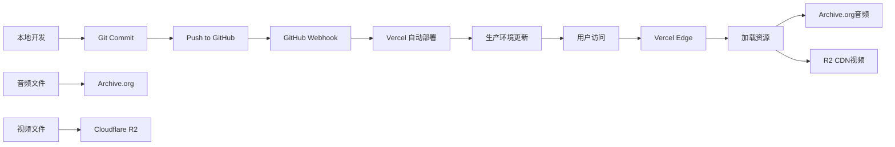
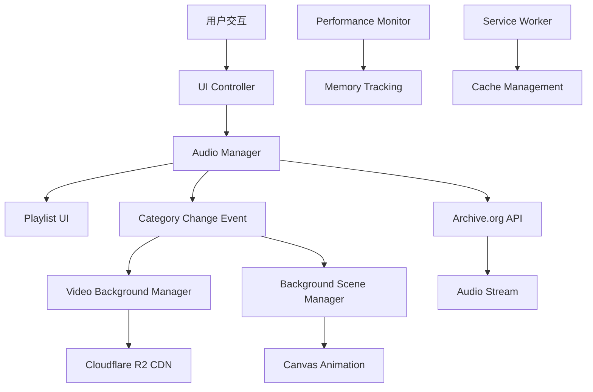

# 🏗️ 声音疗愈应用 - 技术架构文档

## 📋 项目概览

**项目名称**: 声音疗愈 (Sound Healing)
**版本**: v3.0.0 (企业级现代Web应用)
**部署状态**: ✅ 生产环境运行中
**官网**: https://soundflows.app
**技术栈**: HTML5 + CSS3 + Vanilla JavaScript + PWA

## 🌐 基础设施架构

### 宿管平台分布

| 组件 | 平台 | URL | 用途 |
|------|------|-----|------|
| **前端应用** | Vercel | https://soundflows.app | 主站点托管 |
| **音频文件** | Internet Archive | https://archive.org/download/sound-healing-collection/ | 长期稳定存储 |
| **视频文件** | Cloudflare R2 | https://media.soundflows.app/ | 全球CDN加速 |
| **代码仓库** | GitHub | https://github.com/Jeff9420/sound-healing-app | 版本控制与CI/CD |
| **域名** | Cloudflare | soundflows.app | DNS管理与安全防护 |

### 部署流程



## 💾 应用架构

### 核心模块结构

```
assets/js/
├── app.js                          # 主应用控制器
├── audio-manager.js                # 音频管理核心
├── playlist-ui.js                  # 播放列表UI
├── video-background-manager.js     # 视频背景管理
├── background-scene-manager.js     # Canvas降级场景
├── ui-controller.js                # UI控制器
├── theme-manager.js                # 主题管理
├── i18n-system.js                  # 国际化系统
├── i18n-translations-addon.js      # 多语言翻译
├── performance-monitor.js          # 性能监控
├── sleep-timer.js                  # 睡眠定时器
├── audio-config.js                 # 音频配置（Archive.org）
└── deploy-trigger.js               # 部署触发器
```

### 数据流架构



## 🎵 音频系统架构

### 音频托管策略

1. **主存储**: Internet Archive
   - 优点：永久保存、非营利性、高可靠性
   - URL模式: `https://archive.org/download/sound-healing-collection/{category}/{filename}`

2. **本地配置**: `assets/js/audio-config.js`
   ```javascript
   const AUDIO_CONFIG = {
       baseUrl: 'https://archive.org/download/sound-healing-collection/',
       categories: {
           'Animal sounds': {
               folder: 'animal-sounds',
               files: [...] // 213个音频文件
           }
       }
   };
   ```

3. **音频管理器**: `AudioManager` 类
   - 格式检测与兼容性处理
   - 播放列表控制
   - 进度跟踪
   - 内存管理

### 音频分类映射

| 应用分类 | Archive.org文件夹 | 文件数量 |
|---------|------------------|---------|
| Animal sounds | animal-sounds | 26 |
| Chakra | chakra | 7 |
| Fire | fire-sounds | 4 |
| hypnosis | hypnosis | 70 |
| meditation | meditation | 14 |
| Rain | rain-sounds | 14 |
| running water | water-sounds | 6 |
| Singing bowl sound | singing-bowls | 61 |
| Subconscious Therapy | subconscious-therapy | 11 |

## 🎬 视频系统架构

### 视频托管策略

1. **主存储**: Cloudflare R2 CDN
   - 优点：全球加速、低延迟、高可用
   - URL模式: `https://media.soundflows.app/{path}/{filename}`

2. **路径配置**: 支持多路径自动尝试
   ```javascript
   const videoPaths = [
       `${baseUrl}video/${filename}`,    // video/ 目录
       `${baseUrl}videos/${filename}`,   // videos/ 目录
       `${baseUrl}${filename}`          // 根目录
   ];
   ```

3. **视频管理器**: `VideoBackgroundManager` 类
   - 智能预加载
   - 平滑切换过渡
   - CORS处理
   - 自动降级到Canvas

### 视频分类映射

| 音频分类 | 视频文件 | 场景描述 |
|---------|---------|---------|
| Animal sounds | forest-birds.ia.mp4 | 森林鸟鸣 |
| Chakra | energy-chakra.ia.mp4 | 脉轮能量 |
| Fire | campfire-flames.ia.mp4 | 篝火火焰 |
| hypnosis | cosmic-stars.ia.mp4 | 宇宙星空 |
| meditation | zen-bamboo.ia.mp4 | 禅意竹林 |
| Rain | rain-drops.ia.mp4 | 雨滴涟漪 |
| running water | flowing-stream.ia.mp4 | 流水潺潺 |
| Singing bowl sound | temple-golden.ia.mp4 | 金色寺庙 |
| Subconscious Therapy | dreamy-clouds.ia.mp4 | 梦境云海 |

## 🌍 国际化架构

### 支持语言

1. **默认语言**: English (en-US)
2. **支持语言**:
   - 中文简体 (zh-CN)
   - 日本語 (ja-JP)
   - 한국어 (ko-KR)
   - Español (es-ES)

### 实现方式

- **数据属性**: `data-i18n` 标记HTML元素
- **翻译数据**: `assets/js/i18n-translations-addon.js`
- **动态切换**: `I18nSystem.changeLanguage()`
- **本地存储**: localStorage 持久化用户选择

## 🎨 UI/UX架构

### 主题系统

- **明亮主题**: 默认浅色主题
- **深色主题**: 自动检测系统偏好
- **主题切换**: `ThemeManager.toggleTheme()`

### 响应式设计

- **桌面端**: 1200px+ 宽屏布局
- **平板端**: 768px-1199px 自适应
- **手机端**: 320px-767px 垂直布局

### PWA功能

- **Service Worker**: 离线缓存支持
- **Web App Manifest**: 原生应用体验
- **安装提示**: Add to Home Screen

## 🚀 部署架构

### Vercel配置

```json
{
  "version": 2,
  "builds": [
    {
      "src": "index.html",
      "use": "@vercel/static"
    }
  ],
  "headers": [
    {
      "source": "/(.*)",
      "headers": [
        {
          "key": "Cache-Control",
          "value": "public, max-age=31536000"
        }
      ]
    }
  ]
}
```

### CI/CD流程

1. **开发环境**: 本地开发和测试
2. **Git Push**: 推送到GitHub主分支
3. **自动触发**: Vercel Webhook
4. **构建部署**: 静态资源部署
5. **域名更新**: 自动更新soundflows.app

### 性能优化

- **代码分割**: 按需加载JavaScript模块
- **资源压缩**: Gzip/Brotli压缩
- **缓存策略**: 长期缓存静态资源
- **CDN加速**: Vercel Edge Network

## 📊 监控与分析

### 性能监控

- **Performance Monitor**: 内存使用跟踪
- **Lighthouse**: 性能评分
- **Web Vitals**: 核心性能指标

### 错误处理

- **全局错误捕获**: window.onerror
- **音频错误**: 优雅降级到下一首
- **视频错误**: 自动切换到Canvas
- **网络错误**: 离线模式支持

## 🔒 安全架构

### 内容安全策略

```javascript
Content-Security-Policy: default-src 'self';
script-src 'self' 'unsafe-inline';
style-src 'self' 'unsafe-inline';
media-src 'self' https://archive.org https://media.soundflows.app;
connect-src 'self' https://archive.org https://media.soundflows.app;
```

### 隐私保护

- **无追踪**: 不使用Google Analytics等追踪工具
- **本地存储**: 所有偏好设置保存在本地
- **HTTPS强制**: 全站SSL加密
- **无cookies**: 不收集用户个人信息

## 🛠️ 开发工作流

### 环境要求

- **Node.js**: >=14.0.0 (可选，仅用于工具脚本)
- **Git**: 版本控制
- **现代浏览器**: Chrome/Firefox/Safari/Edge

### 调试工具

- **快速音频测试**: `quick-audio-test.html`
- **浏览器兼容性**: `browser-audio-test.html`
- **文件名验证**: `test-english-filenames.html`

### 发布流程

1. 本地测试所有功能
2. 更新版本号和CHANGELOG
3. Git commit并push到main分支
4. Vercel自动部署（2-3分钟）
5. 验证生产环境功能

## 📈 未来规划

### 短期目标

- [ ] 添加更多音频分类
- [ ] 优化视频加载性能
- [ ] 增加播放历史功能
- [ ] 支持自定义播放列表

### 长期目标

- [ ] 开发移动端APP
- [ ] 添加在线冥想课程
- [ ] 社区分享功能
- [ ] AI推荐系统

---

**最后更新**: 2025年10月22日
**维护者**: Sound Healing Team
**联系方式**: 通过GitHub Issues