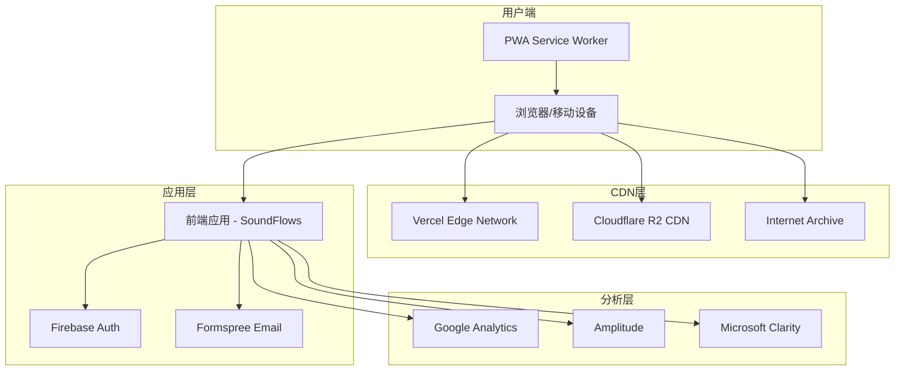
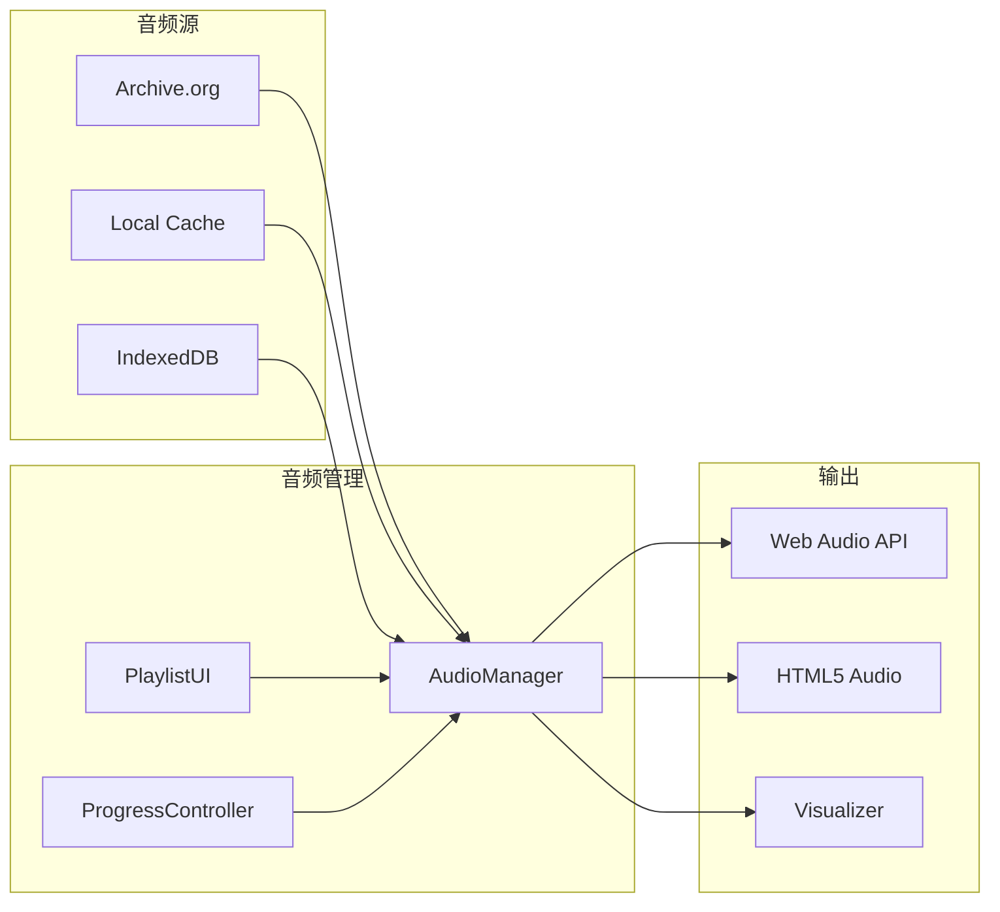
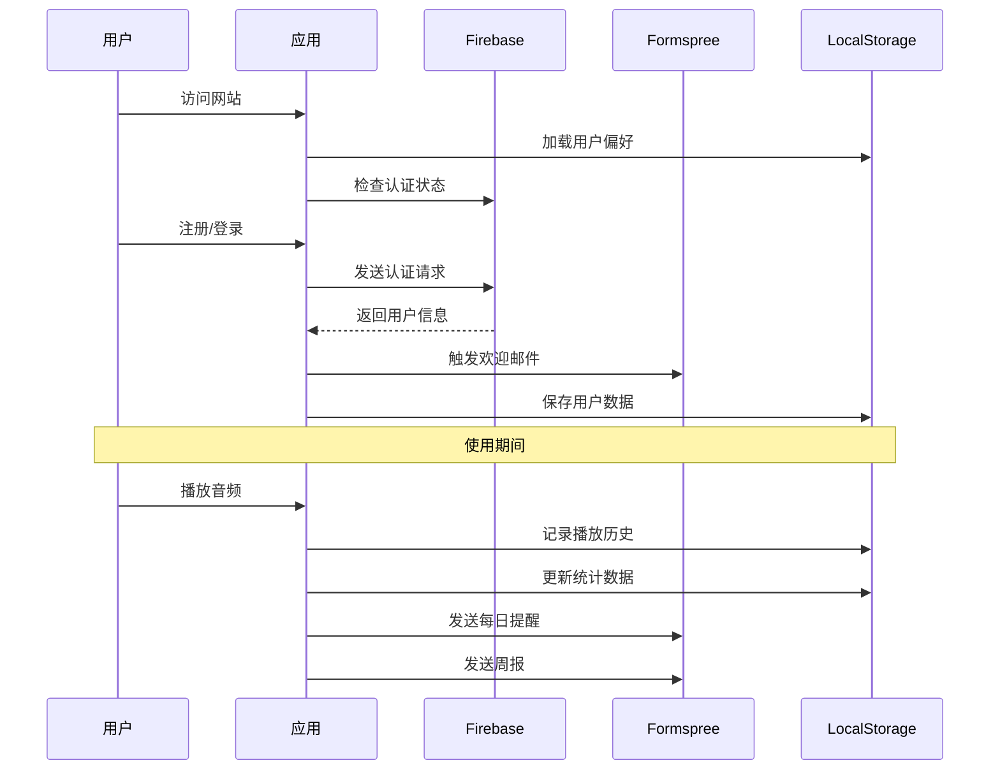
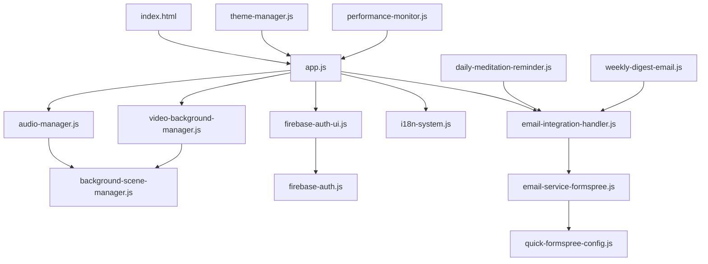
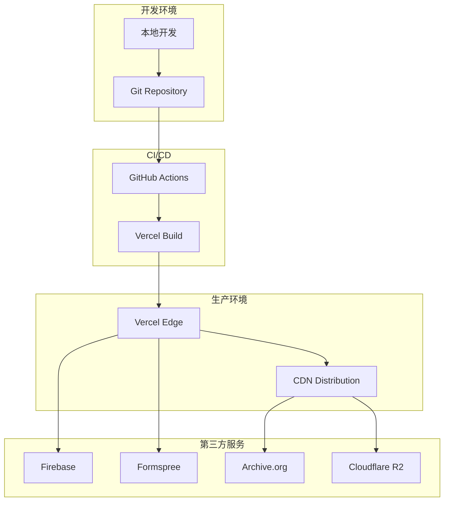

# 技术架构文档

## 系统架构图

### 1. 整体架构



### 2. 音频系统架构



### 3. 数据流架构



### 4. 模块依赖关系



### 5. 部署架构



## 技术选型说明

### 前端框架选择

#### 为什么选择原生JavaScript？
1. **性能优势**：无框架开销，直接DOM操作
2. **加载速度**：更少的包体积，更快的首屏
3. **兼容性**：所有浏览器原生支持
4. **学习成本**：团队熟悉，易于维护
5. **灵活性**：完全控制，无框架限制

#### 为什么不使用React/Vue？
- 项目复杂度中等，不需要重型框架
- 音频处理需要精细控制，原生API更直接
- SEO要求可通过服务端渲染或静态生成解决
- PWA功能原生支持良好

### 状态管理

#### LocalStorage策略
```javascript
// 用户设置
const userSettings = {
    language: 'zh-CN',
    theme: 'dark',
    volume: 70,
    reminderEnabled: true
};

// 用户数据
const userData = {
    playHistory: [],
    favorites: [],
    statistics: {},
    streakDays: 0
};
```

### 音频处理架构

#### Web Audio API vs HTML5 Audio
| 特性 | Web Audio API | HTML5 Audio |
|------|---------------|-------------|
| 控制 | 精细控制 | 基础控制 |
| 兼容性 | 现代浏览器 | 所有浏览器 |
| 功能 | 音效处理、可视化 | 简单播放 |
| 复杂度 | 高 | 低 |

**我们的选择**：混合使用
- 基础播放：HTML5 Audio
- 高级功能：Web Audio API

### 认证方案

#### Firebase Authentication优势
1. **多平台支持**：Google、邮箱、匿名
2. **安全性**：Google背书，安全可靠
3. **易集成**：简单的SDK集成
4. **免费额度**：10,000 MAA免费
5. **功能丰富**：邮箱验证、密码重置等

### 邮件服务对比

| 服务 | 免费额度 | 需要验证 | API复杂度 | 选择原因 |
|------|----------|----------|------------|----------|
| Formspree | 50/月 | ❌不需要 | 简单 | ✅已选 |
| Mailgun | 100/月 | ✅手机 | 中等 | 需要手机验证 |
| SendGrid | 100/月 | ✅手机 | 中等 | 需要手机验证 |
| Brevo | 300/月 | ✅手机 | 中等 | 需要手机验证 |
| EmailJS | 200/月 | ❌不需要 | 简单 | 模板限制 |

**最终选择**：Formspree（无手机验证要求）

### CDN策略

#### 多层CDN架构
1. **主应用**：Vercel Edge Network
   - 全球分布
   - 自动优化
   - 边缘函数

2. **视频资源**：Cloudflare R2
   - 成本效益高
   - 流量免费
   - 全球加速

3. **音频资源**：Internet Archive
   - 永久存储
   - 无限带宽
   - 非营利组织

### 性能优化策略

#### 1. 加载优化
```javascript
// 预加载关键资源
<link rel="preload" href="critical.css" as="style">
<link rel="preload" href="app.js" as="script">

// 懒加载非关键资源
const lazyLoad = (src) => {
    const script = document.createElement('script');
    script.src = src;
    script.async = true;
    document.body.appendChild(script);
};
```

#### 2. 缓存策略
```javascript
// Service Worker缓存策略
const CACHE_STRATEGY = {
    static: 'cache-first',      // 静态资源
    api: 'network-first',      // API请求
    audio: 'cache-first',      // 音频文件
    images: 'cache-first'      // 图片资源
};
```

#### 3. 代码分割
```javascript
// 动态导入模块
const loadModule = async (moduleName) => {
    const module = await import(`./modules/${moduleName}.js`);
    return module.default;
};
```

## 安全架构

### 1. 内容安全策略 (CSP)
```html
<meta http-equiv="Content-Security-Policy"
      content="default-src 'self';
               script-src 'self' 'unsafe-inline'
                         https://www.gstatic.com
                         https://www.googletagmanager.com;
               style-src 'self' 'unsafe-inline';
               img-src 'self' data: https:;
               media-src 'self' https://archive.org;
               connect-src 'self'
                         https://formspree.io
                         https://firebaseio.com;
               font-src 'self';">
```

### 2. 认证安全
```javascript
// JWT Token管理
const authManager = {
    // Token自动刷新
    refreshToken: async () => {
        const token = await firebase.auth().currentUser.getIdToken(true);
        localStorage.setItem('authToken', token);
    },

    // 会话超时
    checkSession: () => {
        const lastActivity = localStorage.getItem('lastActivity');
        const timeout = 24 * 60 * 60 * 1000; // 24小时

        if (Date.now() - lastActivity > timeout) {
            firebase.auth().signOut();
        }
    }
};
```

### 3. 数据保护
```javascript
// 敏感数据加密
const encryptData = (data) => {
    // 使用Web Crypto API
    return crypto.subtle.encrypt(algorithm, key, data);
};

// GDPR合规
const gdprManager = {
    // 数据导出
    exportData: () => {
        const userData = localStorage.getItem('userData');
        return JSON.stringify(userData);
    },

    // 数据删除
    deleteData: () => {
        localStorage.clear();
        indexedDB.deleteDatabase('AudioCache');
    }
};
```

## 监控和调试

### 1. 性能监控
```javascript
// Core Web Vitals追踪
const vitalsTracker = {
    trackLCP: () => {
        new PerformanceObserver((list) => {
            const entries = list.getEntries();
            const lastEntry = entries[entries.length - 1];
            gtag('event', 'LCP', { value: lastEntry.renderTime });
        }).observe({ entryTypes: ['largest-contentful-paint'] });
    },

    trackFID: () => {
        new PerformanceObserver((list) => {
            for (const entry of list.getEntries()) {
                gtag('event', 'FID', { value: entry.processingStart - entry.startTime });
            }
        }).observe({ entryTypes: ['first-input'] });
    }
};
```

### 2. 错误追踪
```javascript
// 全局错误处理
window.addEventListener('error', (event) => {
    const errorData = {
        message: event.message,
        filename: event.filename,
        lineno: event.lineno,
        colno: event.colno,
        stack: event.error?.stack,
        userAgent: navigator.userAgent,
        url: window.location.href
    };

    // 发送到错误追踪服务
    sendErrorReport(errorData);
});
```

### 3. 用户行为分析
```javascript
// 自定义事件追踪
const analytics = {
    trackAudioPlay: (category, track) => {
        gtag('event', 'audio_play', {
            category: category,
            track_name: track,
            timestamp: Date.now()
        });

        amplitude.track('Audio Played', {
            category,
            track
        });
    },

    trackUserSession: (duration) => {
        gtag('event', 'session_duration', {
            value: duration
        });
    }
};
```

## 部署流程

### 1. CI/CD流程 (GitHub Actions → Vercel)

```yaml
# .github/workflows/deploy.yml
name: Deploy to Vercel

on:
  push:
    branches: [main]

jobs:
  deploy:
    runs-on: ubuntu-latest
    steps:
      - uses: actions/checkout@v2
      - name: Setup Node.js
        uses: actions/setup-node@v2
        with:
          node-version: '18'
      - name: Install dependencies
        run: npm install
      - name: Build
        run: npm run build
      - name: Deploy to Vercel
        uses: amondnet/vercel-action@v20
        with:
          vercel-token: ${{ secrets.VERCEL_TOKEN }}
          vercel-org-id: ${{ secrets.ORG_ID }}
          vercel-project-id: ${{ secrets.PROJECT_ID }}
```

### 2. 环境变量配置

```bash
# Vercel环境变量
NEXT_PUBLIC_FIREBASE_API_KEY=xxx
NEXT_PUBLIC_FIREBASE_AUTH_DOMAIN=xxx
NEXT_PUBLIC_FIREBASE_PROJECT_ID=xxx
FORMSPREE_FORM_ID=mldpqopn
GOOGLE_ANALYTICS_ID=G-4NZR3HR3J1
AMPLITUDE_API_KEY=b6c4ebe3ec4d16c8f5fd258d29653cfc
```

### 3. 域名和SSL

```json
{
  "domain": "soundflows.app",
  "dns": {
    "type": "A",
    "name": "@",
    "value": "76.76.19.19"
  },
  "ssl": {
    "provider": "Let's Encrypt",
    "autoRenew": true
  }
}
```

## 扩展性考虑

### 1. 微前端架构（未来）
```javascript
// 模块联邦示例
const ModuleFederationPlugin = require('@module-federation/webpack');

module.exports = {
    plugins: [
        new ModuleFederationPlugin({
            name: 'soundflows',
            remotes: {
                meditation: 'meditation@https://meditation.soundflows.app/remoteEntry.js',
                sleep: 'sleep@https://sleep.soundflows.app/remoteEntry.js'
            }
        })
    ]
};
```

### 2. API设计（未来后端）
```javascript
// RESTful API设计
const API_ROUTES = {
    // 用户管理
    '/api/users': {
        GET: '获取用户信息',
        POST: '创建用户',
        PUT: '更新用户',
        DELETE: '删除用户'
    },

    // 音频管理
    '/api/audio': {
        GET: '获取音频列表',
        POST: '上传音频',
        PUT: '更新音频信息',
        DELETE: '删除音频'
    },

    // 统计数据
    '/api/analytics': {
        GET: '获取统计数据',
        POST: '记录事件'
    }
};
```

### 3. 数据库设计（未来）
```sql
-- 用户表
CREATE TABLE users (
    id UUID PRIMARY KEY,
    email VARCHAR(255) UNIQUE,
    display_name VARCHAR(100),
    created_at TIMESTAMP,
    last_login TIMESTAMP
);

-- 音频表
CREATE TABLE audio_tracks (
    id UUID PRIMARY KEY,
    title VARCHAR(255),
    category VARCHAR(100),
    duration INTEGER,
    file_url TEXT,
    play_count INTEGER DEFAULT 0
);

-- 播放记录表
CREATE TABLE play_history (
    id UUID PRIMARY KEY,
    user_id UUID REFERENCES users(id),
    audio_id UUID REFERENCES audio_tracks(id),
    played_at TIMESTAMP,
    duration_played INTEGER
);
```

---

## 总结

SoundFlows采用现代化的前端架构，具有以下特点：

1. **轻量级**：原生JavaScript，无框架依赖
2. **高性能**：多层CDN，智能缓存
3. **可扩展**：模块化设计，易于扩展
4. **用户友好**：PWA支持，离线可用
5. **国际化**：5种语言，全球可用

这种架构选择确保了应用的高性能、可维护性和可扩展性，为用户提供优质的音频疗愈体验。

---

*文档创建时间: 2025-01-24*
*最后更新: 2025-01-24*